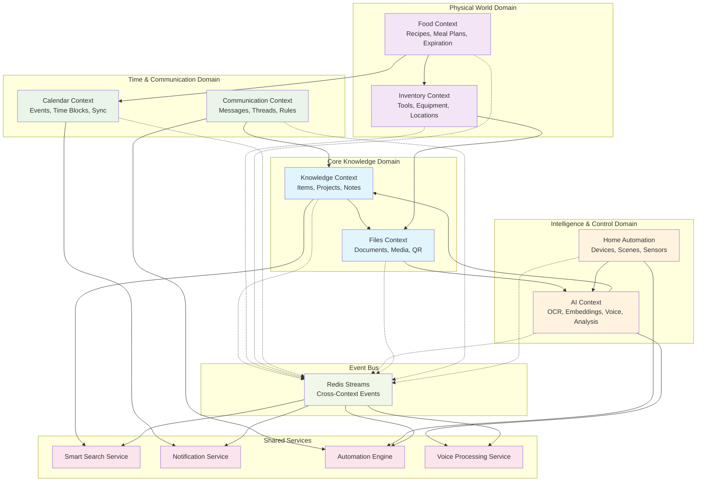
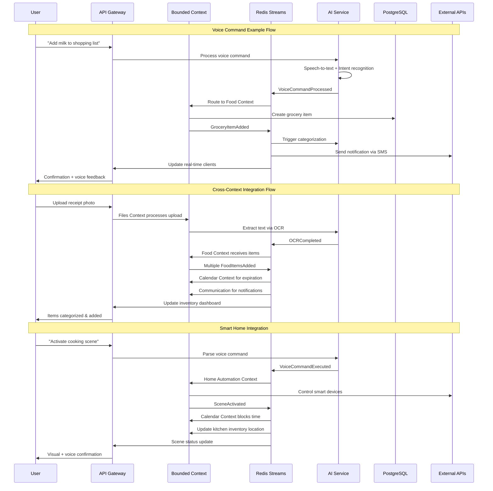
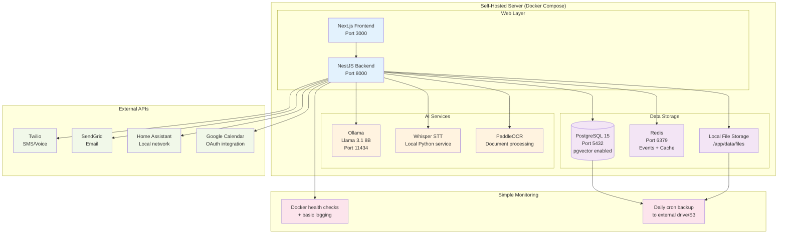

# PRD - Product Requirements Document

[project]
name = "Unified Knowledge Platform"
version = "1.0.0"
description = "Self-hosted knowledge management with food, calendar, inventory tracking, communication, voice control, and home automation"
architecture = "event-driven-hexagonal"

## Technology Stack

### Backend
- **Framework**: NestJS (Node.js + TypeScript)
- **Architecture**: Hexagonal/Clean Architecture with bounded contexts
- **Database**: PostgreSQL 15+ with pgvector extension
- **Event Bus**: Redis Streams with ioredis client
- **Cache**: Redis (shared with event bus)
- **File Storage**: Local filesystem with organized directory structure
- **Authentication**: JWT with refresh tokens
- **API Documentation**: Auto-generated OpenAPI/Swagger

### Frontend
- **Web App**: Next.js 15 with TypeScript
- **Mobile**: Progressive Web App (PWA)
- **UI Library**: Tailwind CSS + Headless UI
- **State Management**: Zustand + TanStack Query
- **Real-time**: WebSocket connections to NestJS

### AI/ML Services
- **Local LLM**: Ollama (Llama 3.1 8B, 4-bit quantized)
- **Speech-to-Text**: OpenAI Whisper (local deployment)
- **Text-to-Speech**: Piper TTS (local deployment)
- **OCR**: PaddleOCR (Python service)
- **Embeddings**: nomic-embed-text model
- **Image Processing**: Sharp.js for web, Python PIL for AI

### Infrastructure
- **Deployment**: Docker Compose for development, Docker Swarm optional for production
- **Reverse Proxy**: Traefik with automatic SSL (Let's Encrypt)
- **Monitoring**: Basic health checks + structured logging
- **Backup**: Automated PostgreSQL dumps + file system backups

### Development Tools
- **Language**: TypeScript (strict mode)
- **Linting**: ESLint with complexity limits (max 8, max 30 lines per function)
- **Formatting**: Prettier
- **Testing**: Jest + Supertest for API, Vitest for frontend
- **Package Manager**: npm
- **Version Control**: Git with conventional commits

## System Requirements

### Hardware (Self-Hosted Server)
- **CPU**: 8 cores x86_64 ✅ (Current server meets requirements)
- **RAM**: 32GB available ✅ (Exceeds 16GB minimum requirement)
- **Storage**: 455GB total, 210GB free ✅ (Exceeds 500GB requirement)
- **Network**: Stable internet connection for external API integrations

### Software Dependencies (Current Server Status)
- **Docker**: Docker Engine 27.5.1 ✅ and Docker Compose 2.35.1 ✅
- **Operating System**: Ubuntu 24.04.2 LTS ✅ (Latest stable)
- **Node.js**: 20.19.3 ✅ (Perfect for NestJS development)
- **NestJS CLI**: 11.0.10 ✅ (Globally installed)
- **TypeScript**: 5.8.3 ✅ (Latest stable)
- **Python**: 3.12.3 ✅ (For AI services)
- **Git**: 2.43.0 ✅ (For version control and deployment)

### External Services (Optional)
- **Twilio**: SMS/Voice messaging (API key required)
- **SendGrid**: Email notifications (API key required)
- **Google Calendar**: Calendar sync (OAuth setup required)
- **Home Assistant**: Smart home integration (local network access)

### Performance Targets (Adjusted for Current Hardware)
- **Boot Time**: < 90 seconds full stack startup (improved with 32GB RAM)
- **Memory Usage**: ~12GB under normal load (comfortable with 32GB available)
- **API Response**: < 200ms for most endpoints
- **AI Processing**: < 1.5s for OCR, < 400ms for voice commands (optimized for 8-core CPU)
- **Concurrent Users**: 50+ users (upgraded from 10+ due to hardware capacity)

[architecture]
pattern = "hexagonal"
communication = "event-driven"
deployment = "self-hosted"
scaling = "modular-microservices"

## High-Level System Architecture

```mermaid
graph TB
    subgraph "External Interfaces"
        WEB[Web App<br/>Next.js 15]
        MOBILE[Mobile PWA<br/>React Native]
        VOICE[Voice Interface<br/>Web Speech API]
        SMS[SMS/Text<br/>Twilio]
        EMAIL[Email<br/>IMAP/SMTP]
        DEVICES[Smart Devices<br/>Home Assistant]
    end

    subgraph "API Gateway Layer"
        GATEWAY[NestJS Gateway<br/>JWT Auth + Rate Limiting]
    end

    subgraph "Application Layer - Bounded Contexts"
        KNOWLEDGE[Knowledge Context<br/>Tasks, Projects, Notes]
        INVENTORY[Inventory Context<br/>Physical Items, QR Codes]
        FOOD[Food Context<br/>Recipes, Meal Plans]
        CALENDAR[Calendar Context<br/>Events, Time Blocks]
        AI[AI Context<br/>OCR, Embeddings, Voice]
        FILES[Files Context<br/>Media, Documents]
        COMMS[Communication Context<br/>Messages, Threads]
        HOME[Home Automation<br/>Devices, Scenes]
    end

    subgraph "Event Bus Layer"
        REDIS[Redis Streams<br/>Event Bus + NATS Fallback]
    end

    subgraph "Infrastructure Layer"
        DB[(PostgreSQL 15+<br/>pgvector, uuid-ossp)]
        MINIO[MinIO Storage<br/>S3-Compatible Files]
        SEARCH[Vector Search<br/>pgvector + embeddings]
        CACHE[Redis Cache<br/>Session + Real-time]
    end

    subgraph "AI/ML Services"
        OLLAMA[Ollama Local LLM<br/>Llama 3.1 8B]
        WHISPER[Whisper STT<br/>Local Speech-to-Text]
        PIPER[Piper TTS<br/>Text-to-Speech]
        OCR[PaddleOCR<br/>Document Processing]
    end

    WEB --> GATEWAY
    MOBILE --> GATEWAY
    VOICE --> GATEWAY
    SMS --> GATEWAY
    EMAIL --> GATEWAY
    DEVICES --> GATEWAY

    GATEWAY --> KNOWLEDGE
    GATEWAY --> INVENTORY
    GATEWAY --> FOOD
    GATEWAY --> CALENDAR
    GATEWAY --> AI
    GATEWAY --> FILES
    GATEWAY --> COMMS
    GATEWAY --> HOME

    KNOWLEDGE --> REDIS
    INVENTORY --> REDIS
    FOOD --> REDIS
    CALENDAR --> REDIS
    AI --> REDIS
    FILES --> REDIS
    COMMS --> REDIS
    HOME --> REDIS

    KNOWLEDGE --> DB
    INVENTORY --> DB
    FOOD --> DB
    CALENDAR --> DB
    AI --> SEARCH
    FILES --> MINIO
    COMMS --> DB
    HOME --> DB

    AI --> OLLAMA
    AI --> WHISPER
    AI --> PIPER
    AI --> OCR

    GATEWAY --> CACHE
```

[architecture.event_bus]
primary = "Redis Streams"
fallback = "NATS"
persistence = true
replay_capability = true

[architecture.api_gateway]
framework = "NestJS"
auth = "JWT + refresh tokens"
rate_limiting = true
cors_enabled = true

[architecture.database]
primary = "PostgreSQL 15+"
extensions = ["pgvector", "uuid-ossp", "pg_trgm"]
backup_strategy = "WAL-E + S3"
connection_pooling = "PgBouncer"

[architecture.storage]
files = "MinIO (S3-compatible)"
images = "WebP optimization pipeline"
backups = "Automated daily snapshots"

## Bounded Context Relationships

[bounded_contexts]

  [bounded_contexts.knowledge]
  description = "Core knowledge management - tasks, projects, notes, documents"
  aggregate_roots = ["Item", "Project", "Note"]
  events = ["ItemCreated", "ItemUpdated", "ItemDeleted", "ProjectLinked"]
  ports = ["ItemRepository", "SearchIndex", "FileStorage"]
  adapters = ["PostgreSQLItemRepo", "ElasticsearchIndex", "MinIOStorage"]

  [bounded_contexts.inventory]
  description = "Physical item tracking - tools, devices, equipment"
  aggregate_roots = ["PhysicalItem", "Location", "Category"]
  events = ["ItemAdded", "LocationChanged", "MaintenanceScheduled", "QRGenerated"]
  ports = ["InventoryRepository", "QRGenerator", "LocationTracker"]
  adapters = ["PostgreSQLInventoryRepo", "PythonQRCode", "GPSLocationAdapter"]

  [bounded_contexts.food]
  description = "Food inventory, meal planning, grocery management"
  aggregate_roots = ["FoodItem", "Recipe", "MealPlan", "GroceryList"]
  events = ["FoodExpiring", "RecipeCreated", "GroceryItemAdded", "MealPlanned"]
  ports = ["FoodRepository", "NutritionAPI", "ExpirationTracker"]
  adapters = ["PostgreSQLFoodRepo", "USDANutritionAPI", "ExpirationNotifier"]

  [bounded_contexts.calendar]
  description = "Calendar integration and time management"
  aggregate_roots = ["Event", "CalendarSync", "TimeBlock"]
  events = ["EventCreated", "ReminderTriggered", "CalendarSynced", "TimeBlocked"]
  ports = ["CalendarRepository", "ExternalCalendarSync", "NotificationService"]
  adapters = ["PostgreSQLCalendarRepo", "GoogleCalendarSync", "PushNotificationAdapter"]

  [bounded_contexts.ai]
  description = "AI processing - OCR, embeddings, auto-tagging, smart search, voice processing"
  aggregate_roots = ["AIAnalysis", "Embedding", "SmartTag", "VoiceRecording", "VoiceCommand"]
  events = ["OCRCompleted", "EmbeddingGenerated", "TagsProposed", "AnalysisReady", "VoiceProcessed", "CommandExecuted", "SpeechSynthesized"]
  ports = ["LLMService", "VectorStore", "OCRProcessor", "SpeechToText", "TextToSpeech", "VoiceCommandProcessor"]
  adapters = ["OllamaLLM", "PgVectorStore", "PaddleOCR", "WhisperSTT", "PiperTTS", "VoiceCommandAdapter"]

  [bounded_contexts.files]
  description = "File management, media processing, QR codes"
  aggregate_roots = ["File", "MediaAsset", "QRCode"]
  events = ["FileUploaded", "ThumbnailGenerated", "QRScanned", "MediaProcessed"]
  ports = ["FileStorage", "ImageProcessor", "QRProcessor"]
  adapters = ["MinIOStorage", "SharpImageProcessor", "ZXingQRProcessor"]

  [bounded_contexts.communication]
  description = "Text messaging, email, and notification delivery"
  aggregate_roots = ["TextMessage", "EmailMessage", "NotificationRule", "DeliveryStatus", "MessageThread"]
  events = ["MessageSent", "MessageReceived", "DeliveryConfirmed", "RuleTriggered", "ThreadCreated", "EmailParsed"]
  ports = ["MessageProvider", "EmailProvider", "NotificationEngine", "MessageParser"]
  adapters = ["TwilioSMS", "SendGridEmail", "IMAPAdapter", "SMTPAdapter", "EmailParserAdapter"]

  [bounded_contexts.home_automation]
  description = "Smart home device control and automation"
  aggregate_roots = ["SmartDevice", "Scene", "Automation", "Hub", "Sensor"]
  events = ["DeviceStateChanged", "SceneActivated", "AutomationTriggered", "SensorDataReceived", "DeviceDiscovered"]
  ports = ["DeviceController", "HubConnector", "AutomationEngine", "SensorReader", "DeviceDiscovery"]
  adapters = ["HomeAssistantHub", "PhilipsHueAdapter", "ZigbeeController", "WiFiDeviceAdapter", "MQTTAdapter"]

[features]

## Event Flow Architecture

  [features.universal_capture]
  description = "Quick capture from any device"
  capabilities = [
    "Voice-to-text notes",
    "Photo with auto-OCR",
    "QR code scanning",
    "Quick add widgets",
    "Offline queue sync",
    "Voice commands",
    "SMS capture",
    "Email parsing"
  ]

  [features.smart_search]
  description = "AI-powered search across all data"
  capabilities = [
    "Natural language queries",
    "Vector similarity search",
    "Cross-domain results",
    "Search suggestions",
    "Saved search filters",
    "Voice search queries",
    "Message content search"
  ]

  [features.visual_organization]
  description = "Visual-first data organization"
  capabilities = [
    "Drag-drop kanban boards",
    "Graph view relationships",
    "Image-based browsing",
    "Timeline views",
    "Spatial location maps",
    "Device status dashboards"
  ]

  [features.automation]
  description = "Smart automation and workflows"
  capabilities = [
    "Auto-categorization",
    "Expiration notifications",
    "Maintenance reminders",
    "Smart grocery lists",
    "Calendar time blocking",
    "Voice-triggered actions",
    "Smart home scenes",
    "Message-based task creation",
    "Email rule processing"
  ]

  [features.communication_hub]
  description = "Unified communication management"
  capabilities = [
    "Multi-channel messaging",
    "Smart notifications",
    "Message threading",
    "Auto-reply rules",
    "Contact integration",
    "Delivery tracking"
  ]

  [features.voice_control]
  description = "Comprehensive voice interaction"
  capabilities = [
    "Natural language commands",
    "Voice note capture",
    "Text-to-speech feedback",
    "Multi-language support",
    "Offline voice processing",
    "Voice authentication"
  ]

  [features.home_integration]
  description = "Smart home control and monitoring"
  capabilities = [
    "Device discovery and control",
    "Scene management",
    "Automation rules",
    "Sensor monitoring",
    "Energy tracking",
    "Security integration"
  ]

[domains]

  [domains.knowledge_management]
  entities = ["tasks", "projects", "notes", "documents", "links"]
  
    [domains.knowledge_management.tasks]
    fields = ["title", "description", "due_date", "priority", "status", "project_id", "created_from_message", "voice_memo_id"]
    relationships = ["belongs_to_project", "depends_on_task", "uses_tools", "triggered_by_message", "has_voice_memo"]
    ai_features = ["auto_priority", "time_estimation", "dependency_detection", "voice_task_creation"]

    [domains.knowledge_management.projects]
    fields = ["name", "description", "status", "start_date", "end_date", "communication_channels"]
    relationships = ["contains_tasks", "uses_tools", "references_docs", "has_message_threads"]
    ai_features = ["progress_tracking", "resource_optimization", "timeline_prediction", "communication_analysis"]

  [domains.inventory_management]
  entities = ["tools", "devices", "equipment", "locations", "categories"]
  
    [domains.inventory_management.tools]
    fields = ["name", "brand", "model", "serial_number", "purchase_date", "location", "condition", "smart_device_id"]
    relationships = ["stored_in_location", "belongs_to_category", "used_by_project", "controlled_by_automation"]
    qr_integration = true
    maintenance_tracking = true
    smart_integration = true

    [domains.inventory_management.locations]
    fields = ["name", "description", "parent_location", "qr_code", "smart_sensors", "automation_zone"]
    relationships = ["contains_items", "nested_locations", "monitored_by_sensors", "controlled_by_hub"]
    visual_mapping = true
    sensor_integration = true

  [domains.food_management]
  entities = ["food_items", "recipes", "meal_plans", "grocery_lists", "nutrition"]
  
    [domains.food_management.food_items]
    fields = ["name", "brand", "category", "expiration_date", "quantity", "location", "nutritional_info", "smart_storage"]
    relationships = ["used_in_recipes", "on_grocery_lists", "stored_in_location", "monitored_by_sensors"]
    ai_features = ["expiration_prediction", "usage_tracking", "waste_reduction", "voice_inventory_updates"]

    [domains.food_management.recipes]
    fields = ["name", "ingredients", "instructions", "prep_time", "cook_time", "servings", "nutrition", "voice_instructions"]
    relationships = ["requires_ingredients", "part_of_meal_plan", "tagged_categories", "has_voice_guide"]
    ai_features = ["ingredient_substitution", "nutrition_optimization", "cooking_assistance", "voice_cooking_guide"]

    [domains.food_management.meal_plans]
    fields = ["date", "meal_type", "recipe_id", "servings", "notes", "grocery_notification_sent"]
    relationships = ["uses_recipes", "generates_grocery_items", "linked_to_calendar", "triggers_notifications"]
    ai_features = ["meal_suggestions", "nutrition_balancing", "shopping_optimization", "automated_grocery_ordering"]

  [domains.calendar_integration]
  entities = ["events", "time_blocks", "reminders", "sync_profiles"]
  
    [domains.calendar_integration.events]
    fields = ["title", "description", "start_time", "end_time", "location", "attendees", "source", "voice_reminder", "automation_trigger"]
    relationships = ["blocks_time", "triggers_reminders", "linked_to_projects", "has_notifications", "triggers_home_scenes"]
    sync_sources = ["google_calendar", "outlook", "apple_calendar", "email_invitations"]

    [domains.calendar_integration.time_blocks]
    fields = ["start_time", "end_time", "activity_type", "project_id", "focus_level", "do_not_disturb"]
    relationships = ["reserves_time", "supports_projects", "optimizes_schedule", "controls_notifications", "activates_focus_mode"]
    ai_features = ["optimal_scheduling", "focus_time_protection", "meeting_preparation", "smart_environment_control"]

  [domains.communication_management]
  entities = ["messages", "threads", "contacts", "rules", "templates"]

    [domains.communication_management.messages]
    fields = ["content", "sender", "recipient", "timestamp", "channel", "status", "ai_analysis", "action_items"]
    relationships = ["belongs_to_thread", "triggers_rules", "creates_tasks", "references_projects"]
    ai_features = ["sentiment_analysis", "action_extraction", "auto_categorization", "smart_replies"]

    [domains.communication_management.threads]
    fields = ["subject", "participants", "channel", "status", "project_linkage", "auto_archive_date"]
    relationships = ["contains_messages", "linked_to_projects", "triggers_automations"]
    ai_features = ["thread_summarization", "participant_analysis", "outcome_tracking"]

    [domains.communication_management.rules]
    fields = ["name", "conditions", "actions", "priority", "enabled", "success_rate"]
    relationships = ["processes_messages", "creates_automations", "manages_notifications"]
    ai_features = ["rule_optimization", "condition_learning", "action_prediction"]

  [domains.voice_interaction]
  entities = ["voice_commands", "voice_recordings", "speech_models", "command_mappings"]

    [domains.voice_interaction.voice_commands]
    fields = ["command_text", "intent", "entities", "confidence", "user_id", "timestamp", "execution_result"]
    relationships = ["maps_to_actions", "creates_tasks", "controls_devices", "triggers_searches"]
    ai_features = ["intent_recognition", "entity_extraction", "personalized_models", "context_awareness"]

    [domains.voice_interaction.voice_recordings]
    fields = ["audio_file", "transcript", "duration", "quality", "processed", "linked_item"]
    relationships = ["becomes_notes", "creates_tasks", "updates_items", "triggers_actions"]
    ai_features = ["speech_to_text", "noise_reduction", "speaker_identification", "emotion_detection"]

  [domains.home_automation]
  entities = ["devices", "scenes", "automations", "sensors", "hubs"]

    [domains.home_automation.devices]
    fields = ["name", "type", "brand", "model", "location", "status", "capabilities", "energy_usage", "last_seen"]
    relationships = ["belongs_to_hub", "part_of_scenes", "triggers_automations", "monitored_by_sensors"]
    ai_features = ["usage_pattern_analysis", "predictive_maintenance", "energy_optimization", "anomaly_detection"]

    [domains.home_automation.scenes]
    fields = ["name", "description", "device_states", "triggers", "schedule", "active"]
    relationships = ["controls_devices", "triggered_by_events", "linked_to_calendar", "activated_by_voice"]
    ai_features = ["scene_optimization", "adaptive_scheduling", "context_awareness", "user_preference_learning"]

    [domains.home_automation.automations]
    fields = ["name", "conditions", "actions", "enabled", "success_rate", "last_triggered"]
    relationships = ["monitors_sensors", "controls_devices", "sends_notifications", "creates_tasks"]
    ai_features = ["condition_optimization", "action_prediction", "failure_analysis", "adaptive_learning"]

[clients]

  [clients.web_app]
  framework = "Next.js 15"
  ui_library = "Tailwind CSS + Headless UI"
  state_management = "Zustand + React Query"
  features = ["full_crud", "drag_drop", "real_time_updates", "offline_support", "voice_controls", "device_dashboard"]

  [clients.mobile_app]
  type = "PWA + React Native hybrid"
  camera_integration = true
  offline_first = true
  push_notifications = true
  features = [
    "qr_scanning", 
    "voice_capture", 
    "photo_ocr", 
    "location_services",
    "background_sync",
    "sms_integration",
    "voice_commands",
    "device_control"
  ]

  [clients.desktop_app]
  framework = "Tauri (optional)"
  native_integrations = ["file_system", "notifications", "shortcuts", "microphone", "speakers"]
  features = ["bulk_import", "advanced_search", "keyboard_shortcuts", "voice_control", "email_client"]

  [clients.voice_interface]
  type = "Web Speech API + Native TTS"
  wake_word = "Hey Knowledge"
  offline_capable = true
  features = ["command_recognition", "natural_conversation", "contextual_responses", "multi_language"]

## Deployment Architecture

[infrastructure]

  [infrastructure.compute]
  primary = "VPS (16GB RAM, 8 CPU cores)"  # Increased for voice/AI processing
  scaling = "Docker Swarm or K3s"
  monitoring = "Prometheus + Grafana"
  logging = "Loki + Vector"

  [infrastructure.storage]
  database = "PostgreSQL 15 (6GB shared_buffers)"  # Increased for additional data
  files = "MinIO cluster (4TB initial)"  # Increased for voice recordings
  cache = "Redis 7+ (4GB memory)"  # Increased for real-time features
  backup = "Automated S3 snapshots"

  [infrastructure.networking]
  reverse_proxy = "Traefik"
  ssl = "Let's Encrypt auto-renewal"
  domain = "*.yourdomain.com wildcard"
  cdn = "Optional Cloudflare"
  websockets = "Real-time communication support"
  mqtt = "Home automation message broker"

  [infrastructure.security]
  auth = "JWT + refresh tokens"
  encryption = "AES-256 at rest"
  transport = "TLS 1.3"
  backup_encryption = "GPG encrypted"
  voice_encryption = "Real-time audio encryption"

[deployment]

  [deployment.development]
  orchestration = "Docker Compose"
  hot_reload = true
  test_data = "Fixtures + factories"
  local_ai = "Ollama with small models"
  mock_services = ["twilio", "sendgrid", "home_assistant"]

  [deployment.production]
  orchestration = "Docker Swarm or Kubernetes"
  blue_green = true
  health_checks = true
  auto_scaling = "CPU/memory based"
  service_mesh = "Optional Istio for complex routing"

  [deployment.backup_strategy]
  database = "WAL-E continuous archiving"
  files = "rsync to multiple locations"
  configuration = "Git-based config management"
  disaster_recovery = "Automated restoration scripts"
  voice_data = "Encrypted backup of voice models"

[integrations]

  [integrations.external_apis]
  google_calendar = { enabled = true, scope = ["read", "write"] }
  nutrition_apis = { primary = "USDA", fallback = "Spoonacular" }
  weather = { provider = "OpenWeatherMap", for = "food_storage_advice" }
  twilio = { enabled = true, scope = ["sms", "voice", "whatsapp"] }
  sendgrid = { enabled = true, scope = ["email", "templates"] }
  home_assistant = { enabled = true, scope = ["device_control", "automation", "sensors"] }
  google_speech = { enabled = false, alternative = "whisper_local" }
  openai_whisper = { enabled = true, deployment = "local" }

  [integrations.import_export]
  formats = ["json", "csv", "markdown", "ical", "vcf", "mbox"]
  bulk_operations = true
  api_access = "REST + GraphQL"
  voice_export = ["wav", "mp3", "transcripts"]

[ai_models]

  [ai_models.local_llm]
  primary = "Llama 3.1 8B"
  backup = "Mistral 7B"
  quantization = "4-bit for resource efficiency"
  specialized_models = [
    { name = "nomic-embed-text", purpose = "embeddings" },
    { name = "llava", purpose = "vision_analysis" },
    { name = "whisper-small", purpose = "speech_to_text" },
    { name = "piper-tts", purpose = "text_to_speech" },
    { name = "intent-classifier", purpose = "voice_command_classification" }
  ]

  [ai_models.capabilities]
  text_analysis = ["sentiment", "categorization", "summarization", "intent_recognition"]
  image_processing = ["ocr", "object_detection", "scene_understanding"]
  speech_processing = ["transcription", "synthesis", "command_recognition", "speaker_identification"]
  predictive = ["expiration_dates", "maintenance_schedules", "usage_patterns", "device_failures"]
  automation = ["rule_generation", "scene_optimization", "energy_efficiency", "anomaly_detection"]

[performance_targets]

  [performance_targets.response_times]
  search_query = "< 200ms"
  image_upload = "< 2s processing"
  page_load = "< 1s initial"
  offline_sync = "< 5s when online"
  voice_command = "< 500ms recognition"
  text_message = "< 1s delivery"
  device_control = "< 200ms response"

  [performance_targets.scalability]
  concurrent_users = 100
  total_items = "1M+ items"
  file_storage = "10TB capacity"
  search_index = "Real-time updates"
  voice_commands = "100/minute per user"
  messages_per_day = "10K+ across all channels"
  connected_devices = "500+ smart home devices"

[development_phases]

## Data Flow Diagram

```mermaid
flowchart TD
    subgraph "Input Sources"
        USER_VOICE[Voice Commands<br/>Whisper STT]
        USER_TEXT[Text Input<br/>Web/Mobile]
        USER_FILES[File Uploads<br/>Photos/Documents]
        SMS_IN[Incoming SMS<br/>Twilio Webhook]
        EMAIL_IN[Email Processing<br/>IMAP Parser]
        QR_SCAN[QR Code Scans<br/>Camera/ZXing]
        SENSORS[Smart Home Sensors<br/>Home Assistant]
    end

    subgraph "Processing Pipeline"
        GATEWAY[API Gateway<br/>Authentication & Routing]

        subgraph "AI Processing Layer"
            OCR[OCR Engine<br/>PaddleOCR]
            LLM[Local LLM<br/>Llama 3.1 8B]
            EMBEDDINGS[Vector Embeddings<br/>nomic-embed-text]
            INTENT[Intent Recognition<br/>Voice Commands]
        end

        EVENT_BUS[Event Bus<br/>Redis Streams]
    end

    subgraph "Domain Processing"
        KNOWLEDGE_PROC[Knowledge Processing<br/>Tasks, Notes, Projects]
        FOOD_PROC[Food Processing<br/>Recipes, Expiration]
        INVENTORY_PROC[Inventory Processing<br/>Items, Locations]
        COMMS_PROC[Communication Processing<br/>Messages, Rules]
        HOME_PROC[Home Automation<br/>Device Control]
    end

    subgraph "Data Storage"
        POSTGRESQL[(PostgreSQL<br/>Structured Data<br/>pgvector)]
        MINIO[(MinIO<br/>Files & Media<br/>S3-Compatible)]
        REDIS_CACHE[(Redis<br/>Cache & Sessions<br/>Real-time Data)]
    end

    subgraph "Output Channels"
        WEB_UI[Web Dashboard<br/>Real-time Updates]
        MOBILE_UI[Mobile App<br/>PWA + Notifications]
        VOICE_OUT[Voice Responses<br/>Piper TTS]
        SMS_OUT[SMS Notifications<br/>Twilio]
        EMAIL_OUT[Email Notifications<br/>SendGrid]
        SMART_DEVICES[Smart Device Control<br/>Home Assistant]
    end

    %% Input Flow
    USER_VOICE --> GATEWAY
    USER_TEXT --> GATEWAY
    USER_FILES --> GATEWAY
    SMS_IN --> GATEWAY
    EMAIL_IN --> GATEWAY
    QR_SCAN --> GATEWAY
    SENSORS --> GATEWAY

    %% AI Processing Flow
    GATEWAY --> OCR
    GATEWAY --> LLM
    GATEWAY --> INTENT
    OCR --> EMBEDDINGS
    LLM --> EMBEDDINGS

    %% Event Distribution
    GATEWAY --> EVENT_BUS
    OCR --> EVENT_BUS
    LLM --> EVENT_BUS
    INTENT --> EVENT_BUS

    %% Domain Processing
    EVENT_BUS --> KNOWLEDGE_PROC
    EVENT_BUS --> FOOD_PROC
    EVENT_BUS --> INVENTORY_PROC
    EVENT_BUS --> COMMS_PROC
    EVENT_BUS --> HOME_PROC

    %% Data Storage Flow
    KNOWLEDGE_PROC --> POSTGRESQL
    FOOD_PROC --> POSTGRESQL
    INVENTORY_PROC --> POSTGRESQL
    COMMS_PROC --> POSTGRESQL
    HOME_PROC --> POSTGRESQL

    USER_FILES --> MINIO
    EMBEDDINGS --> POSTGRESQL
    GATEWAY --> REDIS_CACHE

    %% Output Flow
    EVENT_BUS --> WEB_UI
    EVENT_BUS --> MOBILE_UI
    EVENT_BUS --> VOICE_OUT
    EVENT_BUS --> SMS_OUT
    EVENT_BUS --> EMAIL_OUT
    EVENT_BUS --> SMART_DEVICES

    %% Data Retrieval for Responses
    POSTGRESQL --> WEB_UI
    POSTGRESQL --> MOBILE_UI
    MINIO --> WEB_UI
    MINIO --> MOBILE_UI
    REDIS_CACHE --> WEB_UI
    REDIS_CACHE --> MOBILE_UI

    classDef input fill:#e3f2fd
    classDef processing fill:#e8f5e8
    classDef ai fill:#fff3e0
    classDef domain fill:#f3e5f5
    classDef storage fill:#fce4ec
    classDef output fill:#f1f8e9

    class USER_VOICE,USER_TEXT,USER_FILES,SMS_IN,EMAIL_IN,QR_SCAN,SENSORS input
    class GATEWAY,EVENT_BUS processing
    class OCR,LLM,EMBEDDINGS,INTENT ai
    class KNOWLEDGE_PROC,FOOD_PROC,INVENTORY_PROC,COMMS_PROC,HOME_PROC domain
    class POSTGRESQL,MINIO,REDIS_CACHE storage
    class WEB_UI,MOBILE_UI,VOICE_OUT,SMS_OUT,EMAIL_OUT,SMART_DEVICES output
```

  [development_phases.phase_1]
  name = "Core Foundation"
  duration = "4 weeks"
  deliverables = [
    "Hexagonal architecture setup",
    "Basic CRUD for all domains",
    "Event bus implementation",
    "Database schema + migrations"
  ]

  [development_phases.phase_2] 
  name = "AI & File Processing"
  duration = "3 weeks"
  deliverables = [
    "OCR pipeline",
    "Local LLM integration", 
    "Vector embeddings",
    "Smart search implementation"
  ]

  [development_phases.phase_3]
  name = "Mobile & QR Features" 
  duration = "3 weeks"
  deliverables = [
    "PWA with camera access",
    "QR generation/scanning",
    "Offline-first sync",
    "Push notifications"
  ]

  [development_phases.phase_4]
  name = "Domain-Specific Features"
  duration = "4 weeks" 
  deliverables = [
    "Food management workflows",
    "Calendar integration",
    "Advanced inventory tracking",
    "Automation rules engine"
  ]

  [development_phases.phase_5]
  name = "Communication & Voice"
  duration = "4 weeks"
  deliverables = [
    "Text messaging integration",
    "Email processing pipeline",
    "Voice command system",
    "Speech synthesis",
    "Communication automation rules"
  ]

  [development_phases.phase_6]
  name = "Home Automation"
  duration = "3 weeks"
  deliverables = [
    "Smart device discovery",
    "Home Assistant integration", 
    "Scene management",
    "Sensor monitoring",
    "Automation engine"
  ]

  [development_phases.phase_7]
  name = "Production & Polish"
  duration = "2 weeks"
  deliverables = [
    "Production deployment",
    "Performance optimization",
    "Monitoring setup",
    "Documentation",
    "Integration testing"
  ]

[cross_domain_integrations]

  [cross_domain_integrations.voice_to_knowledge]
  description = "Voice commands create tasks, notes, and projects"
  events = ["VoiceTaskCreated", "VoiceNoteAdded", "VoiceSearchTriggered"]
  use_cases = ["Add milk to grocery list", "Create reminder for 3pm", "Search for pasta recipes"]

  [cross_domain_integrations.communication_to_tasks]
  description = "Messages automatically create actionable items"
  events = ["MessageTaskExtracted", "EmailActionCreated", "SMSReminderSet"]
  use_cases = ["Extract meeting action items", "Create tasks from TODO emails", "Process grocery texts"]

  [cross_domain_integrations.home_to_inventory]
  description = "Smart devices update inventory status"
  events = ["DeviceUsageTracked", "MaintenanceAlert", "EnergyUsageLogged"]
  use_cases = ["Track tool usage via smart plugs", "Fridge inventory via sensors", "Appliance maintenance alerts"]

  [cross_domain_integrations.calendar_to_automation]
  description = "Calendar events trigger home automation"
  events = ["MeetingSceneActivated", "WorkModeEnabled", "SleepScheduleTriggered"]
  use_cases = ["Dim lights during meetings", "Enable focus mode", "Bedtime routine automation"]

  [cross_domain_integrations.food_to_communication]
  description = "Food expiration triggers notifications"
  events = ["ExpirationAlertSent", "GroceryListShared", "MealPlanNotification"]
  use_cases = ["SMS expiration alerts", "Share grocery lists via text", "Weekly meal plan emails"]